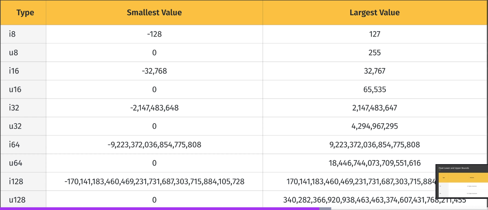
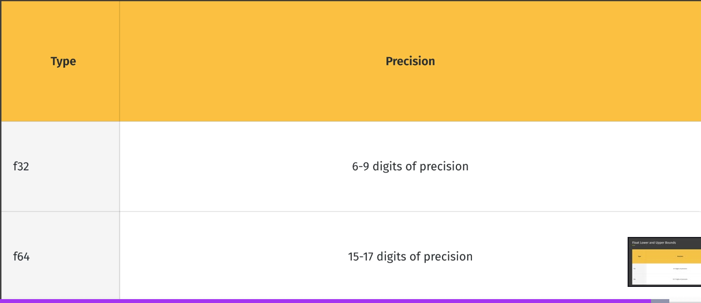

# anotacoes

Este arquivo serve para fazer anotações sobre o aprendizado em rust.

---


## Como funciona?

Funciona da seguinte forma tudo vai ser escrito de uma maneira diferente ao invés de irmos digitando de cima para baixo como acontece normalmente em arquivos de texto vamos digitar de baixo para cima.

Usando o template abaixo:

---

## Titulo

Descricao 

---

## 135. Syntactic Shortcuts

Nesta lição vamos ver alguns atalhos da sintaxe para slices.

Este atalho pode ser usado em Strings e str não tem diferenciação.

código à ser explicado:

```rust
fn main() {
    let actor = String::from("Arnold Schwarzenegger");

    let primeiro_nome = &actor[..6];
    println!("{primeiro_nome}");

    let sobrenome = &actor[7..];
    println!("{sobrenome}");
}
```
Os atalhos é para simplificar quando estamos pegando algo do início até um valor que queremos então para não digitarmos o zero não colocamos nada, ficando apenas ***..6***;

Mesma coisa para o final só colocamos da onde queremos pegar e deixamos sem nada que simboliza que queremos pegar até o final.

E se quisermos pegar o "todo" como faremos?
|   Só usar ***[..]***

```rust
let nome_completo = &actor[..];
println!("{nome_completo}");
```

Isso ainda é teoricamente um slice, pois pega tudo mas ainda assim é um slice (É mais fácil usar apenas &variável). 

---

## 134. String Slice Lengths

Agora vamos discutir o tamanho de uma string slice.

O tamanho de uma string slice é a contagem de bytes que ela tem e não os caracteres;

Nós podemos chamar o method .len() que trará o tamanho total que uma string slice tem.

Exemplo:

```rust
fn main() {
    let comida = "pizza";
    println!("{}", comida.len());
    let pedaco_pizza = &comida[0..3];
    println!("{}", pedaco_pizza.len());
}
```

Temos que tomar cuidado pois quando fazemos um slice podemos pegar um caractere que é representado por mais de um byte.

Todos os caracteres do alfabeto conseguem ser representados por um byte, mas os caracteres especiais que são usados em outras linguas precisam de uma sequencia de caracteres para serem representados e também emojis.

Ex:

```rust
fn main() {
    let comida = "📦";
    println!("{}", comida.len());

    let pedaco_pizza = &comida[0..3];
    println!("{}", pedaco_pizza.len());
}

```

---

## 133. String Slices and String Literals

Vamos agora mudar o nosso exemplo anterior de Slice ao invés de usarmos String vamos usar o str e ver como o programa se comporta.

```rust
fn main() {
    let primeiro_nome = {
        let actor: &str = "Arnold Schwarzenegger";
        &actor[0..6]
    };

    println!("{primeiro_nome}");
}
```

Neste caso o código rodaria? Você pode dizer:
|   "Não pois estamos retornando que algo não existiria mais pois no final do "}" a str Arnold Schwarzenegger deixaria de existir."

Mas na verdade o código roda pois o tipo &str é uma referência a uma str que está chumbada no código binário do executável.

Então mesmo que saia do escopo o código não apaga essa str pois ela foi chumbada no código e apenas passamos a referência para esses 6 bytes que existem.

A única diferença do código anterior para esse é que o outro era armazenado na Heap e era propriedade de uma String.


---

## 132. Create a String Slice from a String

Pondo em prática o conceito que vimos em Slices.

Neste exemplo temos o método sem slice:

```rust
fn main() {
    let actor = String::from("Arnold Schwarzenegger");
    let referencia = &actor;
}
```

Aqui pegamos a referência ao nome mas a desvantagem é que pegamos todos o nome.

E se quiséssemos apenas o primeiro nome como faríamos?

```rust
fn main() {
    let actor = String::from("Arnold Schwarzenegger");
    let referencia = &actor[0..6];
}
```

Ao adicionarmos os colchetes e colocarmos o range type, pegamos os 5 primeiros bytes, 0 até o 5;

Pois a maioria das coisas começam em zero na programação.

E assim fazemos um slice de uma coleção, pegamos apenas a parte que nos interessava.

Nota: Na maioria das vezes um caractere vai ocupar apenas um byte, mas acredito eu que caracteres especiais sejam a exceção e outra exceção é emojis então pode ser que tenha que pegar mais bytes.


---

## Slices

Rust tem alguns tipos que são collections/coleções possuem vários dados dentro deles e eles são responsáveis pelos dados dentro deles.

- Um slice/fatia é uma referência a uma porção/sequencia de uma coleção, é uma subcategoria de referência;
- Uma ***fatia*** de uma ***string*** é a referência para uma sequencia de caracteres dessa ***string***;
- Uma ***fatia*** de um ***array*** é uma referência de uma sequencia de elementos de um ***array***;
- Como uma referência, uma ***fatia/slice*** não pega responsabilidade de uma coleção.

Como já diz o significado de ***fatia/slice*** uma fatia é a porção de um todo, pode ser uma porção grande, pequena ou até mesmo o todo.

Exemplo:

```pseudo
Eu sou dono de uma casa;

No conceito anterior eu te empresto a casa toda;

Mas no conceito de slice eu posso te emprestar:

Um quarto;

Um piso da casa;

A casa toda (Mesmo sendo teoricamente a casa toda ela ainda é uma fatia);

```

---

## Resolvendo o coding_challenge

Código:

```rust
fn main() {

    let mut trip = start_trip();

    visit_philadelphia(&mut trip);

    trip.push_str(" and ");

    visit_new_york(&mut trip);

    trip.push_str(" and ");

    visit_boston(&mut trip);

    show_itinerary(&trip);

}

fn start_trip()-> String{
    String::from("The plan is...")
}

fn visit_philadelphia(plan: &mut String){
    plan.push_str("Philadephia")
}

fn visit_new_york(plan: &mut String){
    plan.push_str("New York")
}

fn visit_boston(plan: &mut String){
    plan.push_str("Boston")
}

fn show_itinerary(plan: &String){
    println!("{plan}");
}
```

---

## 126. Ownership with Arrays and Tuples

Vamos ver como funciona o conceito de Ownership em um Array e Tupla.

Colection types como array e tuplas são donos dos valores então eles são responsáveis por limpar a memória depois que saírem do escopo.

Um exemplo seria que uma variável é dona do array mas o tipo array é dono dos próprios valores.

Exemplo em código:

```rust
fn main() {
    let registros = [true, false, true];
}
```

As mesmas regras de Ownership se aplicam então, a variável ***registros*** é o responsável por limpar os dados (o array), mas o array é o responsável pelos elementos internos dele.

Mais código:

```rust
fn main() {
    let registros = [true, false, true];

    let first = registros[0];

    println!("{first} e array {registros:?}");
}
```

Este código funciona pois o ***true*** da posição 0 é um boolean e o tipo boolean implementa o copy trait então tudo funciona normalmente, pois o rust faz uma cópia completa do ***true*** e depois repassa ao first.

Mas e se for um array com tipos de valores que não guardam os dados na memória Stack?

Ex:
```rust
let langs = [String::from("Rust"), String::from("Go")];
let first_lang = langs[0];
```

Neste código temos um array com Strings e vamos tentar adicionar o valor para o variável first_lang, assim o código não compila pois como não tem como usar o Copy Trait rust teria que mover a responsabilidade para a variável, o que não seria possível também, pois o array teria uma responsabilidade parcial pois ele ainda seria responsável pela String Go mas não seria responsável pela String Rust pois ela teve a responsabilidade movida para first_lang.

Mas ao tentar compilar o rust nos dará 2 soluções possíveis para essa situação:

- Uma seria usar o conceito de borrowing, que seria apenas colocar assim:

```rust
let langs = [String::from("Rust"), String::from("Go")];
let first_lang = &langs[0];
```

- E a segunda seria usar o método clone:

```rust
let langs = [String::from("Rust"), String::from("Go")];
let first_lang = langs[0].clone();
```
Desta forma o Rust do clone literalmente clona o texto Rust na Heap o que é ruim pois duplicar algo que já existe é meio redundante.

A melhor seria a primeira pois só pegamos a referência para alterarmos.

A mesma coisa que pode se aplicar para as tuplas só trocar os ***"[]"*** por ***()***.

---

## 125. Dangling References

Dangling references é ponteiro que aponta para um endereço de memória que foi desocupado.

A boa notícia é que o compilador do Rust vai evitar que isso ocorra, ele valida que qualquer referência para um dado não pode ser usado pois o endereço que isso faz refência foi desocupado.

Um exemplo de dangling reference error:

```rust
fn create_city()-> &String{
    let city = String::from("New York");
    &city
}
```
O que acontece aqui, é criada uma variável chamada city mas não tem como acessar o valor de "New York" pois ao retornarmos o endereço do valor o valor será limpo logo em seguida, pois fica fora do escopo da função.

O compilador do Rust vai nos dizer para prefirir apenas para retornar a string inteira.

---

## 124. Ownership with Immutable and Mutable References

Em lições passadas foi ensinado o Copy trait que se um tipo implementa esse valor ele vai automaticamente copiar o que o dono tem e passar para o próximo.

Isso acontece com referências também, se fizermos várias referências imutáveis o Rust vai criar uma cópia completa por ser seguro fazer isso com referências imutáveis.

Uma referência é fácil de copiar pois é apenas um único endereço de memória.

EX:
```rust
fn main() {
    let coffe = String::from("Cafee");
    let a = &coffe;
    let b = a;

    println!("{a}, {b}");
}
```

Aqui podemos ver que o código vai rodar e será possível fazer uso das duas pois é implementado o Copy trait.

Por trás das câmeras rust faz isso:

```rust
    let a = &coffe;
    let b = &coffe;
```

Por ser mais fácil.

Mas referências mutáveis não implementam esse Copy trait, e isso acontece pois tem que respeitar a regra apresenta na aula anterior.

Então se fizermos a referência ser mutável não vai funcionar o código abaixo:

```rust
fn main() {
    let mut coffe = String::from("Cafee");
    // coffe primeiro dono de Caffe

    let a = &mut coffe;
    // a recebe o valor e está usando o Caffe é o dono e pode alterar o valor Caffe

    let b = a;
    // b agora vira dono da referência que é imutável então a responsabilidade de "a" acabou

    println!("{a}, {b}"); // O que está acontecendo aqui? "a" não é mais dono da referência.
}
```

---


## 123. Mutable Reference Restrictions

Um valor em nosso programa pode ter qualquer numero de referências imutáveis.

Agora para referências que são mutáveis é apenas uma por vez. Não se pode nunca ter mais de uma ao mesmo tempo. Para um valor, claro.

Pois é aquela analogia do carro azul e dos amigos. 

Só pode um amigo alterar o carro por vêz. Nunca outra coisa.


Neste código da última aula se fizer essa mudanç:

```rust
fn main() {
    let mut car = String::from("Red");
    let ref1 = &mut car;
    let ref2 = &car;

    println!("{} and {} and {}", &car, ref1, ref2);
}
```
Em ordem para existir uma referência mutável o dono original tem que ser mutável também, então tem que adicionar o mut no original e na referência.

Mas como código atual não será possível ele rodar pois o compilador além de não compilar vai jogar erros para corrigir isso.

Mas se fizermos algo assim:

```rust
fn main() {
    let mut car = String::from("Red");
    let ref1 = &mut car;
    let ref2 = &car;

    println!("{}", ref2);
}
```

O código compila pois ele sabe que não tem risco de existir alguma alteração da string que está sendo apontado.

```rust
    println!("{} and {} and {}", &car, ref1, ref2);
```

Neste caso acontece o erro pois as duas estão sendo usadas ao mesmo tempo.

```rust
fn main() {
    let mut car = String::from("Red");
    let ref1 = &mut car;
    
    ref1.push_str(" e preta");

    println!("{}", ref1);
    
    let ref2 = &car;

    println!("{}", ref2);
}
```

No código acima não existe erro pois o uso de ref1 é feito antes da referência imutavel ser utilizada.

Isso se dá ao fato da feature que está por trás das câmeras, ***Lifetimes***, tempo de vida, basicamente o tempo de vida do ref1 vai até a linha 6 do exemplo acima, como se tivesse um "escopo" indiretamente dizendo que o uso de ref1 vai até quando a referência é passada para ref2.

É como se existisse algo assim por trás das câmeras:

```rust
fn main() {
    let mut car = String::from("Red");

    {let ref1 = &mut car;
    
        ref1.push_str(" e preta");

        println!("{}", ref1);

    }
    
    let ref2 = &car;

    println!("{}", ref2);
}
```


---

## 122. Multiple Immutable References

A vantagem de usar a referência de uma memória é que o programa pode usar isso sem fazer duplicações do valor que está na memória.

O problema ocorre quando temos multiplas referencias com que vão ser usadas em diferentes contextos para um dado.

Vamos supor que uma função tem uma referencia do valor mas uma segunda função muda o valor completamente? Isso vai ocasionar em bugs e comportamentos não mapeados, isso é o que acontecia em outras linguagens.

E Rust trabalha para que isso não aconteça.

Fazendo uma analogia para o mundo real.

- Vamos dizer que você tem um carro azul mas você vai emprestar esse carro para 2 amigos.

- Você dá o endereço da garagem que está o seu carro azul;

- O primeiro amigo prometem que vai ser de uso imutável que não vai haver alterações no seu carro;

- Então é esperado que os dois vão receber emprestado um carro azul e vão retornar um carro azul;

- Mas o seu segundo amigo, pede uma referencia mutável, eles ainda vão pegar o seu carro, você ainda vai ser o dono;

- Mas no tempo que eles estiverem com o carro eles tem a permissão para alterar o carro, como alterar a cor do carro para vermelho;

- Então o 1° espera que o carro seja azul mas o segundo pode alterar ele para vermelho;

- Com isso pode rolar um conflito pois o seu primeiro amigo espera um carro azul e vai receber um carro vermelho;

Como Rust resolve um problema como este?

Nesta aula, foi mostrado que Rust permite ***inúmeras referências imutáveis*** para o mesmo valor ao mesmo tempo.

Você pode criar quantos "empréstimos" quiser, o porque de o Rust permitir é que não tem nenhum perigo nisso, pois o valor emprestado é imutável.

O que podemos dizer é que podemos ter vários leitores do valor mas pode ter apenas um alterando o valor.

Buscando essa explicação para a nossa analogia, basicamente você pode emprestar seu carro para 100 amigos ou mais desde que a referência seja imutável.

Ex em código:

```rust

```

---

## 121. Immutable and Mutable Reference Parameters

Voltando ao mesmo exemplo que vimos anteriormente em ***Retornando valores II***

```rust
fn main() {
    let mut comida_atual = String::new();
    comida_atual = add_sabor(comida_atual);
}

fn add_sabor(mut comida: String) -> String {
    comida.push_str(" sabor energético");
    comida
}
```

Neste caso sempre temos que ficar retornando as coisas para a main function para não ocorrer a dealocação do valor.

Vamos fazer um exemplo que mostra apenas a solução do que estamos precisando com a função ***mostrar_comida***:

```rust
fn mostrar_comida(comida: &String){
    println!("{comida}");
}
```

Ao invés de passarmos o valor alterando a possa passamos a referencia desse valor, assim, alteramos o valor e sem perdelo.

Então é só fazer algo como:

```rust
mostrar_comida(comida);
```

Que o código vai funcionar? Não.

Não vai funcionar, pois vai dar erro de tipo pois a função espera uma referência de uma String e não uma String, então precisaríamos adicionar o "&" na variável.

Código final para o uso correto no Rust:

```rust
fn main() {
    let mut comida_atual = String::new();
    add_sabor(&mut comida_atual);
}

/**
 * Existe 4 maneiras de commo nós definirmos um parâmetro
 * 
 * comida: String - nome do parâmetro, seu tipo,
 * ele recebe a responsabilidade do valor e que ele é imutável;
 * 
 * mut comida: String - nome do parâmetro, seu tipo,
 * ele recebe a responsabilidade do valor e que ele é mutável;
 * 
 * comida: &String - nome do parâmetro,
 * seu tipo que não é uma string e sim a referência de uma string,
 * ele recebe a referência desse valor mas não altera o valor da memória;
 * 
 * comida: &mut String - nome do parâmetro,
 * seu tipo que não é uma string e sim a referência de uma string,
 * ele recebe a referência desse valor e consegue alterá-lo da maneira que quiser;
 * 
 */

fn add_sabor(comida: &mut String) {
    comida.push_str(" sabor energético");
}

fn mostrar_comida(comida: &String){
    println!("{comida}");
}
```

---

## Retornando valores II

Mais algumas regras sobre retorno de valor e manipulação de variáveis.

Exemplo de código que vai se tornar problemáticos:

```rust
fn main() {

    let mut comida_atual = String::new();
    comida_atual = add_sabor(comida_atual);
}


fn add_sabor(mut comida: String) -> String{
    comida.push_str(" sabor energético");
    comida
}
```

Por enquanto é uma função só mas, imagina se for fazer mais e mais funções desse mesmo tipo, como vamos retornar os valores de volta para o __main__?

Pois se for seguindo toda hora tem que ficar retornando o valor e fica muito verboso sendo quase inviável.


---

## Retornando valores I

Vamos discutir como as regras de Ownership podem influenciar no retorno dos valores.

Exemplo:
```rust
fn main() {

    let bolo = faz_bolo();
    println!("{cake}");

    
}

fn faz_bolo()-> String{
    let cake = String::from("Chocolate");
    return cake;
}
```
O que acontece neste exemplo:

- uma variável __cake__ é criada dentro de __faz_bolo__ e essa variável tem posse do valor __"Chocolate"__ que é guardada na Heap pois é uma ***String***;

- Ao terminar a função é retornado esse valor para a variável __bolo__ ou seja, a posse de __cake__ vai para __bolo__ e a __cake__ não possui mais __posse__ de __Chocolate__;

- Ao chegar no final da função __main__ a variável __bolo__ precisa "limpar" a memória Heap, pois __cake__ passou a posse para ela.

---

## Mutable parameters

Assim como variáveis, parâmetros de função são imutáveis por padrão.

Isso quer dizer que não podemos mudar os valores que os parâmetros tem, temos que declarar eles como mutáveis ***mut*** só assim poderemos mudar os valores deles dentro do corpo da função.

Mostrando isso em código:

```rust
fn main() {

    let mut burguer = String::from("Burguer");

    add_fries(burguer);

}

fn add_fries(lanche: String){
    lanche.push_str(" with Fries.");
}
```

Esse código está incorreto pois neste exemplo passamos a posse de Burguer para o lanche e lanche faz a mudança e o lanche "morre" com a alteração pois fica fora de escopo.

Neste trecho
```rust
    add_fries(burguer);
```
O que estamos fazendo?
|   Estamos passando o valor de burguer por parâmetro e estamos, ou movendo a posse de "Burguer" para ***lanche*** que está dentro da função, ou movemos a posse de "Burguer" para lanche.

Neste caso estamos movendo ele pois a String fica armazenada na memória Heap.

O código correto seria:

```rust
fn main() {

    let burguer = String::from("Burguer");

    add_fries(burguer); // let lanche = burguer;
    // movemos a posse para lanche

    // println!("{burguer}");

}

fn add_fries(mut lanche: String){
    lanche.push_str(" with Fries.");
    println!("{lanche}");
}

```

---


## Ownership and Function Parameters

Vamos aprender nessa aula as regras de Ownership que se aplicam também para os parâmetros de funções.

Aprendemos o conceito de Copy trait que a maioria dos tipos em Rust implementão, então esse conceito também é feito dentro de uma function quando passamos por parâmetro, assim não tem um move/tranferência de posse/Owner ele copia os dados da variável para o parâmetro.

```rust
fn main() {
    let oranges = String::from("Oranges");

    print_value(oranges); // let value = oranges; Oranges passa a posse de Oranges para value o parâmetro

    println!("oranges {oranges}"); 


}

fn print_value(value: String){
    println!("The value is {value}");
}// Aqui a string Oranges é apagada pois foje do escopo fazendo
```

---

## Copy trait with Reference

Já utilizamos esse meio dentro do código só não nos "tocamos" disso.

Exemplo do copy em uso:

```rust
fn main() {
    let sorvete = "Flocos";
    let sobremesa = sorvete;

    print!("{} {}", sorvete, sobremesa);
}
```

Ele cpoia a referência da refêrencia e joga para a ***sobremesa***.

---

## String, &String, str and &str

Um ensinamento direto da diferenciação entre esses tipos de string.

Uma aula para reforçar a diferenciação entre esses tipos.


código:
```rust

```

---

## Dereference Operator

Agora vamos aprender sobre o operador que retira a referência, ***Derefence***.

Um operador é um simbolo que aplica uma operação como o operador de adição, que é o "+".

O operador de ***Dereference*** é o operador de multiplicação "*".

O que é esse ***Dereference*** ou dereferência, ao invés de enviarmos o endereço de algo enviamos já o valor deste algo.

Este operador só pode ser usado para acessarmos uma referência, o que significa?
|   Só podemos usar esse valor em referencias

Exemplo:

```rust
fn main() {
    let my_value = 2;
    let my_address: &i32 = &my_value;
    
    println!("{}", *my_address);
    
    let heap_value = String::from("Toyota");
    let heap_address = &heap_value;

    println!("{}", *heap_address);

}
```

Isso tudo já é feito pelo rust por trás das câmeras, foi uma maneira de Boris nos mostrar isso de maneira fácil.

---

## References e Borrowing

Todo valor em Rust tem um dono/Owner por vez.

O desafio vem, quando multiplas partes do código precisam reutilizar o mesmo valor para certos tipos como números, é mais tranquilo para criarmos uma cópia, mas para outros tipos dentro da heap, isso quer dizer em criarmos duplicatas de um valor que vai ocupar um espaço na memória.

Vimos isso no último tópico com a ***Clone function***.

Mas tem outra maneira de fazermos isso sem ficar clonando os valores, podemos usar uma ***Reference***.

### Reference

Uma reference/referência deixa o programa usar um valor sem nós movermos/tranferirmos a posse/responsabilidade do valor.

Nós descrevemos essa ação de criar uma referência de ***borrowing/emprestar***.

Isso é realmente algo que simula o mundo real, pegamos algo emprestado como uma ferramenta por exemplo, e a utilizamos até concluir o que estávamos fazendo, e devolvemos ao dono.


Exemplo em pseudo código:

```pseudo

Pedro possui carro Audi A8 no endereco #800332334

emprestar endereco #800332334 para testDrive

testDrive(&carro)

carro retorna ao dono Pedro

```


Exemplo em código:

```rust
fn main() {
    let my_value = 2;
    let my_address: &i32 = &my_value;

    let heap_value = String::from("Toyota");
    let heap_address = &heap_value;

}
```

Palavras do Boris (Criador do Curso Learn to code with Rust).

```text

Now, technically speaking, there's a small semantic difference between the words reference and pointer.

A reference is a type of pointer.

We can call it a subcategory of pointers in Rust.

A reference is guaranteed t### Reference

Uma reference/referência deixa o programa usar um valor sem nós movermos/tranferirmos a posse/responsabilidade do valor.

Nós descrevemos essa ação de criar uma referência de ***borrowing/emprestar***.

Isso é realmente algo que simula o mundo real, pegamos algo emprestado como uma ferramenta por exemplo, e a utilizamos até concluir o que estávamos fazendo, e devolvemos ao dono.

```


Exemplo em pseudo código:

```pseudo

Pedro possui carro Audi A8 no endereco #800332334

emprestar endereco #800332334 para testDrive

testDrive(&carro)

carro retorna ao dono Pedro

```


Exemplo em código:

```rust
fn main() {
    let my_value = 2;
    let my_address: &i32 = &my_value;

    let heap_value = String::from("Toyota");
    let heap_address = &heap_value;

}
```

Palavras do Boris (Criador do Curso Learn to code with Rust).

```text

Now, technically speaking, there's a small semantic difference between the words reference and pointer.

A reference is a type of pointer.

We can call it a subcategory of pointers in Rust.

A reference is guaranteed to point to a valid value for the life or existence of that reference.

In comparison, a plain pointer in other languages does not have that guarantee.

So what this means is Rust will guarantee that 'my_heap_reference' is going to point to an address in

the heap that is guaranteed to have this String, that is guaranteed to have a valid value.

And, in other languages, you can actually run into problems where that's not the case.

So just to distinguish again in real world terms, a reference is like an address to a house that is

guaranteed to still be standing.

To still be useful.

Right.

A pointer is like an address to a house that may or may not be there anymore.

So a reference is safer.

```

Semanticamente falando Reference é um tipo de ponteiro, uma referencia é garantido que se for vc o endereço que a referencia traz, vai encontrar o valor do exemplo que foi feito em código.

Em outras linguagens podemos enfrentar alguns erros se seguirmos esse exemplo.

Pois como é dito por Boris, o ponteiro é um endereço para uma casa que pode ou não estar mais lá, sendo assim referência é mais segura.

---
```text

o point to a valid value for the life or existence of that reference.

In comparison, a plain pointer in other languages does not have that guarantee.

So what this means is Rust will guarantee that 'my_heap_reference' is going to point to an address in

the heap that is guaranteed to have this String, that is guaranteed to have a valid value.

And, in other languages, you can actually run into problems where that's not the case.

So just to distinguish again in real world terms, a reference is like an address to a house that is

guaranteed to still be standing.

To still be useful.

Right.

A pointer is like an address to a house that may or may not be there anymore.

So a reference is safer.

```

Semanticamente falando Reference é um tipo de ponteiro, uma referencia é garantido que se for vc o endereço que a referencia traz, vai encontrar o valor do exemplo que foi feito em código.

Em outras linguagens podemos enfrentar alguns erros se seguirmos esse exemplo.

Pois como é dito por Boris, o ponteiro é um endereço para uma casa que pode ou não estar mais lá, sendo assim referência é mais segura.

E uma regra que tem que ficar clara:

|   Uma referencia não pode existir por mais tempo que o referente, ou o referente não pode ser apagado antes da referência

|   Refences must never outlive their referent.


---

## Clone function

O modelo de Ownership em Rust existe para previnir problemas comuns que são presentes em outras linguagens de programação.

Um benefício que temos do modelo de Ownership é que ele requisita ao programador pra explícitamente dizer que vai fazer uma cópia de um valor na memória Heap.

Rust sempre vai evitar fazer cópias de valores na memória Heap pois ele quer ser rápido, ele quer usar a menor quantidade de memória possível, então temos que manualmente dizer que a gente precisa duplicar este dado.

Está função ***clone()*** é um requisito do trait ***Clone***, quando o implementamos em um tipo este tipo "diz" como ele deveria ser clonado/duplicado.

```rust
fn main() {
    let person: String = String::from("Pedro");
    let genius = person.clone();

    println!("{person}");
}
```

Neste caso o código está válido, pois como usamos o método clone, não foi usado o ***move*** mas ainda tem um custo, nós duplicamos os dois textos Pedro na Heap um sendo o person que está responsável por limpar o Pedro da memória heap.

Tentamos sempre evitar isso, só utilizamos se for realmente necessário.

---


## The Drop Function

Esta função é para desalocar os valores associados a uma variável,
Rust já chama essa função para tudo quando as variáveis ficam fora de escopo.

Essa drop function não funciona com variáveis que estão alocadas na Stack memory só na Heap.


---

## Moves and Ownership

Quando temos um tipo que não possue o trait copy o rust faz oq? Ele move a responsabilidade de uma variável para outra.

Exemplo:
```rust
fn main() {
    let person: String = String::from("Pedro");
    let genius: String = person;
}
```

Quando passamos a variável person para a variável genius não só passamos o valor mas movemos a responsabilidade que ela vai ter que limpar a memória heap.

```rust
fn main() {
    let person: String = String::from("Pedro");
    let genius: String = person;

    print!("{person}");
}
```

Ao fazer isso no código ele vai dar erro pois person não possui mais o valor e nem tem mais responsabilidade sobre o que ele possuia e ocorrendo um erro ao compilar o código.


Mas e se mesmo assim quisessemos chamar person? Aí teríamos que fazer o seguinte:

```rust
fn main() {
    let person: String = String::from("Pedro");

    print!("{person}");

    let genius: String = person;

}
```
Assim o código fica válido pois a variável person só perde a responsabilidade do que ela tem quando passamos para genius, podemos manipular person o quanto quisermos desde que seja antes de passarmos para a outra variável.

---

## The push_str Method on a String type

Como podemos concatenar uma string que foi adicionada na Heap? Simples usamos o método push_str para nos fazer esse favor.

---

## The String type

Um datatype que é alocado na memória heap é a String.

Bem, rust tem dois tipos de String um já vimos anteriormente que era o **str**, neste tipo ele não é armazenado nem dentro da Stack ou na Heap ele é anexado ao compilador isso acontece pois o valor de str já é dito no tempo de compilação.

```rust
fn main() {
    let comida = "massa";
}
```

O tipo de string que estamos falando é o ***String***.

Mas pq o Rust precisa dessa diferenciação como dito antes str é bom quando já sabemos o valor que ele tem mas o String é para receber o valor enquanto o programa roda, como se fossemos inserir nome, endereço, CPF, etc.

No meio tradicional adicionamos a string assim:

```rust
fn main() {
    let text: String = String::new();
}
```

Ou podemos fazer dessa forma:

```rust
fn main() {
    let text: String = String::new();
    let candy: String = String::from("Kill");
}
```


---

## The Copy trait

Vamos aprender sobre a copy trait.

O Copy trait mostra que podemos clonar um tipo.

Os tipos primitivos do Rust como Boolean, Ints, Floats e mais, possuem o Copy trait e isso significa vão ser criadas cópias dos valores desses tipos automaticamente em algumas situações que eles precisem ser duplicados.

Um exemplo em código de como podemos ativar essa duplicação automatica.

```rust
fn main() {
    let time = 2025;
    let year = time; // Aplica o Copy trait e faz uma duplicação do valor dentro de time

    println!("tempo é {time} e ano é {year}");
}

```

Neste simples exemplo que pode se aplicar a mesma coisa para a maioria dos tipos, mas isso se torna diferente quando estamos lidando com heap.

---


## Scope e Ownership

o Owner é quem é responsável por limpar os dados de dentro de uma variável.

E como o Owner sabe que precisa lempar os dados dentro da variável?
|O Owner sabe que precisa limpar os dados quando a variável fica fora de escopo.

Que é quando o bloco de código termina {}

Exemplo em código:

```rust
fn main() {
    let idade = 32; // idade é dona do dado 32

    {
        let handsome = true; // Esta variável só existe neste trecho de código
        // Essa variável só vai existir aqui dentro
    } // Aqui ela fica fora de escopo então simplesmente é limpa da memória

    // idade existe aqui.
}
/*
idade à partir daqui está fora de escopo, sendo assim,
ela é responsável por retirar os dados da memória.
*/
```

Isso é um exemplo que se aplica na Stack mais a frente no curso veremos como funciona dentro da Heap.

---

## Ownership: Stack e Heap

Apesar de já sabermos vamos relembrar:

Stack e Heap são duas regiões diferentes da memória do computador.

Ambos escrevem e lêem dados de maneiras deiferentes o que nos da vantagens e desvantagens.

### Stack

Stack é geralmente rápida, mas ela só suporta um conjunto de dados fixos e de tamanho previsível e esse tamanho já tem que ser informado no tempo de compilação.

A Stack possui uma estrutura que armazena os valores em uma ordem sequencial que recebem os valores e já os remove. Como uma pilha de coisas.

Um exemplo:

bom seria uma pilha de pratos de comida o último a ser colocado é o primeiro a ser retirado.

### Stack II

Todo dado da stack é fixo, tem um tamanho consistente e já é conhecido na hora de compilar o programa.

Um exemplo é o tipo i32 ele sempre será um i32 e o compilador já sabe isso quando vai compilar o programa.


Quando um programa em Rust precisa de um tamanho dinâmico, ele requisita isso para a memória heap. O programa chama o alocador de memória que encontra o local certo que tenha tamanho suficiente para armazenar o valor.


### Heap

Geralmente sendo mais devagar que a memória de Stack, mas ela suporta dados dinâmicos que podem mudar de tamanho com o uso do programa.

A Heap é um grande armazenamento como se fosse um armazém de algum supermercado.

A heap só é requisitada pelo rust quando precisa armazenar algo quando é algo que não sabemos o tamanho, algo como o endereço de alguém ou quando pedimos o anexo de um arquivo, nós não sabemos o tamanho deles então podem ter um tamanho grande demais, então não armazenamos isso na Stack armazenamos isso na Heap.

Como isso funciona? Veremos no tópico seguinte:

### Memory Allocator

Um programa chamado **Memory Allocator** e esse programa procura por um espaço dentro da memória heap grande o suficiente para armazenarmos esse dado.

O MA depois de armazenar retorna um endereço/referência, que é o id da memória que foi armazenado o dado.

Esse endereço/referência pode ser chamado de ponteiro pois isso aponta para onde a memória está armazenada.

### Heap II

A heap é lenta em leitura de dados e também em alocação de dados pois comparada com a stack a stack já sabemos o tamnho local e tudo mais.

Na Heap precisamos procurar o tamanho ideal e depois o endereço para procurar.


### Conclusão

Está seção do curso é focada no conceito de ownership e o propósito de ownership é de responsabilizar a desalocação de memória, particularmente a heap.

---

## Ownership: Introdução

Uma feature única da linguagem, Ownership é um conjunto de regras que o compilador checka para ter certeza que o programa final não possui erros de memória.

Para entender isso precisamos ver como erros como esses podem surgir quando estamos trabalhando com memória.

### Memória

Memória como você já sabe é uma parte do seu hardware que é responsável por armazenar a informação que o seu programa usa.

Muitos programas que abrimos como o Vs code faz uma alocação de memória na memória ram de informações que são importantes para esse programa e toda hora solicita pela memória alocada, outros programas também desalocam memórias que estão armazenadas para maior performance pois nossa memória ram é bem limitada.

### Como funcionava o manejo de memória manual

Em linguagens como C e C++, o programador é o responsável para alocar memória e desalocar memória.

Um dos erros que podem ocorrer por deixar o programador decidir no C/C++ é que o programador pode cometer o erro de esquecer de desalocar a memória o que pode ocorrer de o sistema sempre ficar requisitando memória mas nunca a devolvendo... Outro erro pode ser o de desalocar a memória que já estava desalocada.

### Garbage collector

Outra maneira que encontraram de fazer esse manejo de forma simples é o uso de garbage colector como o Java faz, mas pode desalecerar o programa pois o sistema teria que parar para fazer essa limpeza.

Basicamente esse sistema de garbage analiza a memória que não está mais em uso e limpa ela, o problema com isso é que o garbage colector por sí só já usa memória e pode rodar em alguma hora delicada de deixar o programa lento.

### Solução do Rust no gerenciamento de memória

Rust introduz o paradigma de: Ownership

Indo mais a fundo no que Rust oferece:

O Owner é quem ou o que é responsável por limpar a parte da memória que não está mais em uso.

Todo valor em Rust possui um Owner.

O Owner pode mudar enquanto o programa roda mas é um owner por valor por vez.

Mas o que pode ser um Owner? Uma variável e um parâmetro podem ser Owners.

Ownership se extende também para tipos como tupla ou array, eles são considerados os donos daquele conjunto de valores.

---

## Debugging

Usando o vs code e sua funcionalidade de debugg, podemos executar nosso código uma linha por vez.

Ao invés de rodar o código todo de uma vez, podemos designiar algumas linhas que queremos que o código pare e analizar o comportamento do código.

Essas etapas que queremos parar o código se chamam breakpoints

Como demonstrado na aula 93 podemos percorrer o código trecho por trecho vendo todo o código em sua execução.

### Debug II

Neste trecho vai ser dito um pouco mais afundo no debug.

Quando entramos em debug mode temos algumas abas como VARIABLES que mostra as nossas variáveis né.

E temos a aba de "watch", essa aba é chamada assim pois ela observa os valores referenciados e então faz calculos quando esses valores mudam. Isso vai recomputar alguns dados baseado nos dados que existem no programa.

Basicamente no watch é possível colocar alguns trechos de códigos, como um if/else, <variável> * 2, etc.

Mas pode ocorrer alguns bugs pois coisas muito complexas podem não rodar ou ter um comportamento inesperado.

### Debug III

Nesta parte é para detalharmos o que os outros botões do debug mode fazem.

Alguns botões podem ter o comportamento parecido com o continue button como pular de função em função ou de linha por linha


Nós temos o step over que é o que pula de função em função basicamente falando. Ele para onde vc quer e se vc apertar nele pulamos para a próxima função, sem questionarmos o que roda dentro da função que pulamos.

Temos o step into ele faz o contrário do último ele entre dentro do código da função e podemos ver como está funcionando o código, se você continuar usando o step into ele vai seguir linha por linha o que o código está fazendo.

Se estiver dentro de uma função e quiser se retirar dela pois já foi debuggado o que precisava é só apertar em step out, assim o que faltava ser executado na função era executado e seguimos caminho com o debugg.
---

## Recursão em Rust

Uma das principais funcionalidades da programação é a recursão, basicamente quando uma função chama ela mesma, é uma forma de loop bem sofisticada e complexa.

---

## Loop

O rust tem sua forma de iterar as coisas e de como funciona os loops.

Aqui está o loop tradicional em rust:

```rust
loop {
    // Bloco de código que queira repetir
}
```

Para parar o loop usamos a palavra chave: 

```rust
break;
```

e se quiser fazer um bloco de código que faça alguma modificação e recomece o loop utilize o:

```rust
continue;
```


---

## Funções

As funções se mantém a mesma coisa das outras linguagens só tem alguns diferenciais:


```rust

fn teste(variavel: i32)-> i32 // Isso aqui quer dizer que vai retornar um inteiro de 32 bits

fn teste(variavel: i32)-> i32{
    variavel * 2
}

// Se colocar dessa maneira o rust vai entender que vai ter que retornar sem precisa
// necessáriamente colocar o return explicitamente.

// E tem como fazer uma função dentro de uma variável assim:

let multiplicador = 3;

let calculadora ={
    let value = 5 +4;

    value * multiplicador
};


/// valor de calculadora vai ser 27

```

Aí de resto se mantem tudo igual.

---


## Range type

Um range representa uma sequencia ou intervalo de valores consecutivos.

Por exemplo um range pode pegar todos os números entre 15 e 21, ou isso pode listar todos os caracteres entre "b" e "h"


exemplo:

```rust

fn main() {
    let month_days = 1..26;

    println!("{month_days:?}");

    let month_days = 1..=26;
    println!("{month_days:?}");

    for day in month_days {
        println!("{day}");
    }

    let letras = 'b'..'p';

    for letra in letras {
        println!("{letra}");
    }
}


```

E aqui aprendemos a primeira forma de iterar as coisas em Rust.

---

## Tuple Type

Introdução ao tipo Tuples é mais um tipo de collection como array, diferente do array que necessita que todos os dados dentro dele sejam do mesmo tipo, uma tupla não tem essa limitação então pode ser inserido dentro dela dados de diferentes tipos.


exemplo:

```rust
fn main() {
    let empregado = ("MOLLY", 32, "Marketing");

    // Forma mais simples para associar os dados de uma tupla para variaveis

    let (nome, idade, setor) = empregado;

    // let nome = empregado.0;
    // let idade = empregado.1;
    // let setor = empregado.2;

    println!("{} tem {} e trabalha no {}", nome, idade, setor);

    dbg!(empregado);
}
```

---


## Macro em Rust.

O que são os Macros?

Macro em Rust é código que escreve código.

Por que Rust tem macros?

Rust é bem rigoroso com tipos e não tem coisas como:

- funções variádicas (printf(...))

- reflexão em runtime

As macros resolvem isso:

- evitam repetição de código

- geram código eficiente

- permitem sintaxe mais flexível que funções normais


Macro

```rust
println!("Olá {}", nome);
```

- Executa em tempo de compilação

- Recebe tokens de código, não valores

- Expande para código Rust válido

---


## dbg! Macro

O dbg! é semelhante ao println! ele funciona como uma função mas não é uma função é uma maneira auxiliar.

Mesmo existindo o debug trait ele é como se fosse um acessório, se quiser realmente algo pra poder debuggar é o dbg! que temos que utilizar.

```rust
fn main() {
    let numbers: [i32; 6] = [1, 2, 3, 4, 5, 6];
    let marcas: [&str; 3] = ["apple", "Samsung", "Motorola"];

    println!("{}", marcas.len());

    println!("{:?}", marcas);
    // OU
    println!("{numbers:?}");
    println!("{numbers:#?}");

    dbg!(2 + 2);
    dbg!(numbers);
}

```

Ele é mais fácil de utilzar do que puxar o println! e tudo mais.

---


## Debug Trait

Diferente da display trait o debug serve para nós programadores usarmos.

Ele é comumente usado nos arrays para melhorar a visão do que ele possue dentro dele.

Tem as formas de como fazer isso em código:

```rust
fn main() {
    let numbers: [i32; 6] = [1, 2, 3, 4, 5, 6];
    let marcas: [&str; 3] = ["apple", "Samsung", "Motorola"];

    println!("{}", marcas.len());

    println!("{:?}", marcas);
    // OU
    println!("{marcas:?}");

    // Tem como deixar de forma bonita:

    println!("{marcas:#?}");

}

```

---

## The Display Traits

Uma trait em Rust é como um contrato.

Ela define quais métodos um tipo deve ter para dizer:
    “Eu sei fazer isso”

Se um tipo implementa uma trait, ele promete que possui aqueles métodos.

👉 O como o método funciona pode mudar
👉 Mas o nome e a assinatura do método são os mesmos

🧾 Analogia simples

Trait = contrato
Tipo = pessoa/objeto que assina o contrato

Exemplo do mundo real:

“Você promete chegar às 9h”

Estudante → chega na aula

Funcionário → chega no trabalho

Avião → chega no aeroporto

Todos cumprem o mesmo contrato, mas de formas diferentes.


trait Display

A trait Display diz:

“Este tipo pode ser mostrado como texto legível para humanos”

Ela é usada quando você faz:

```rust
println!("Valor: {}", valor);
```

O {} só funciona se o tipo implementar Display.

✅ Tipos que implementam Display

- i32

- f64

- bool

- String

- &str

Exemplo:

```rust
fn main() {
    let idade = 25;
    let altura = 1.75;
    let ativo = true;

    println!("Idade: {}", idade);
    println!("Altura: {}", altura);
    println!("Ativo: {}", ativo);
}

```

---

## Array, o primeiro scalar/compound type

Array é um tipo escalar ou seja podemos colocar inúmeros dados dentro dele do mesmo tipo que ele funcionara tranquilamente.

exemplo em codigo:

```rust
fn main() {
    let numbers: [i32; 6] = [1, 2, 3, 4, 5, 6];
    let marcas: [&str; 3] = ["apple", "Samsung", "Motorola"];

    println!("{}", marcas.len());

    for number in numbers {
        println!("{}", number);
    }
}
```


Arrays tbm possuem métodos próprios.


---


## Caracteres

O tipo caractere em rust  é  representado de maneira simples:

```rust
let exe = 'v';
```

Só pode ser usado uma letra para este tipo.


alguns métodos de uso:

```rust
fn main() {
    let first_initial = 'b';
    let emoji = '🙂';

    println!(
        "{}, {}",
        first_initial.is_alphabetic(),
        emoji.is_alphabetic()
    );

    println!("{}, {}", first_initial.is_uppercase(), emoji.is_lowercase());

    println!("{}, {}", first_initial.is_uppercase(), emoji.is_lowercase());
}

```

---

## Igual ou diferente, && e ||

Operadores que dizem se algo é igual ou diferente de alguma coisa.

exemplo:

```rust
fn main() {
    println!("{}", "coke" == "pepsi"); // falsse
    println!("{}", "coke" != "coke"); // falsse
    println!("{}", "coke" == "coke"); // true
}


```

Aqueles simbolos de AND (&&) e de OR (||) 


---

## Booleans

Valores booleanos em Rust

```rust
let bonito:bool = true;
let bobo:bool = false;

println!("{bonito}"); // Saida true
println!("{bobo}"); // Saida false


let idade = 17;
let pode_dirigir = idade < 18;

println!("{pode_dirigir}"); // Saida true.

```

### Inversão de Booleans

Conseguimos alterar o valor de um boolean apenas usando o valor !

Assim invertemos os seu valores:


```rust
println!("{}", !true); // Saida false
println!("{}", !false); // Saida true
```

---

## Augmented Assigment Operator

Operações matemáticas mais comuns ou mais simples é assim:

Uma forma de fazermos uma variável mais um em linguagens comuns é:

```C++

int i;
i+=1;
i++;

```
Uma forma mais simples que i = i + 1;

Em rust temos isso também mas apenas isso:


```rust
let mut i = 34;

i = i + 1;

i += 1;

println!({i});

i -= 1;
println!({i});

i *= 2;
println!({i});

year /= 4;
println!({i});


```

---


## Operações matematicas

Operações matemáticas assim como em toda linguagem é os principais:

```rust
let adicao: i32 = 5+9;
let subtracao: i32 = 5-9;
let multiplicacao: i32 = 5*9;

let floor_divisao = 5/3;
println!("{floor_divisao}"); // isso vai printar 1 pois podemos dividir 5 por 3 apenas uma vez

let floor_float = 5.00/3.00;
println!("{floor_float}"); // vai retornar o calculo completo 1.6666

let resto = 8%2;
let resto2 = 9%2;

println!("{resto}"); // vai retornar o resto da divisão de 8 por 2 que seria 0
println!("{resto2}"); // vai retornar o resto da divisão de 9 por 2 que seria 1

```

---

## Título do update

Descrição do que é existe. Neste momento vai ser feito assim...

---

## Casting types

Cast é quando convertemos um tipo de dado para outro no exemplo:


```rust
fn main() {
    let miles_away = 50;
    let miles_away_i8 = miles_away as i8;
    let miles_away_u8 = miles_away as u8;

    let miles_float: f64 = 100.34234;
    let miles_f32 = miles_away as f32;
    let miles_int = miles_away as i32;

    println!("{miles_int}");
}

```

O que fizemos aqui? Se o código for printar o miles_int ele vai trazer como 100 ao invés de ser o número grande que está ligado.

---

## Floating Point types

Algumas manipulções que podemos fazer com os floats


Rust tem o f64 que nos dá uns 15 digitos de precisão para um numero enquanto o 32 vai para apenas 6 ou 7 digitos de precisão.


E conseguimos formatar esses valores para quantos digitos depois da virgula precisamos:


exemplo:
```rust
fn main() {
    let value = 3.1458955885;

    println!("{}", value);
    println!("{value:.2}");
    println!("{0:.4}", value);
    println!("{0:.4}", value);
}
```


---

## Introdução a métodos

Métodos são basicamente funções que ficam dentro de classes, em rust os valores que colocamos como integer também possuem métodos.

Ex:

```rust
fn main() {
    let value: i32 = -15;

    println!("{}", value.abs());
}
```

Neste exemplo o que fizemos? Adicionamos o valor -15 ao value e ao printarmos nós colocamos o .abs() isso é um método do tipo int que abs é o valor absoluto de um numero ou seja, basicamente falando a distancia que esse número tem de zero.

Ao rodar o programa ele vai printar como 15.


Bem tranquilo por enquanto.

---


## Datatypes e seus diferenciais - Strings e Raw Strings

Algumas strings tem seu comportamento diferente.

Temos string que sabemos os seu valores no tempo de compilação:

```rust
println!("HELLO");
```

### valores especiais em strings:

Para dar enter é só colocar o "\n" dentro da string no Rust:

```rust
println!("HELLO \n World");
```

Para dar um tab é só colocar o "\t" dentro da string no Rust:

```rust
println!("HELLO \t World");
```

Para escapar algum caracter é só colocar um "\" dentro.

### Raw string

É basicamente as string que tem ' assim como em outras linguagens esse ' vai ignorar todo e qualquer caractere que seja especial.

Mas em rust fica assim:

```rust
let filepath = r"Hello \n world";
```

O compilador vai interpretar isso literalmente e vai ignorar o \n.


Essas string sabemos no tempo de compilação pois está chumbado no código mas tem strings que não o valor essas são strings que o usuário vai inserir no código quando ele estiver rodando.


---


## Datatypes e seus diferenciais - Inteiros e Floats

Rust tem uma variedade de tipos de dados.

## Scalar types

São tipos que carregam apenas um valor, sendo eles:

- Integers
- floating-points numbers
- Booleans
- Characters

## Container types

Ainda não foi mencionado no curso mas são tipos de dados que carregam mais de um tipo de dado como um "container type".

### Inteiros no Rust

Inteiros nos rust funciona de forma parecida com outras linguagens mas possui um diferencial, conseguimos escolher se queremos guardar numeros inteiros e negativos ou apenas numeros positivos!

E isso está nessa tabela de inteiro como funciona os inteiros:




#### Facilidade na leitura de um numero inteiro

Em rust para facilitar a leitura de um numero apenas adicionar um "_".

Ex:
```rust
// Aqui temos na maneira tradicional de se ler um inteiro
let exemplo = 1000000;
let exemplo = 99999;

// Aqui a maneira facilitada
let exemplo = 1_000_000;
let exemplo = 99_000;
// O compilador vai ignorar esses "_" é como se não existisse para ele  

```

## Usize e Isize 

Todos os tipos de dado que foram abordados até agora ocupam um certo espaço na memória.

Ex: Um F64 ocupa 64 bits de memória independentemente do computador ou architetura que o código está rodando.

Mas temos 2 tipos especiais em rust Usize e Isize

Usize é para unsigned values (apenas numeros do zero para cima)
Isize é para signed values (Ambos os numeros negativos e positivos)

Obs: Eles não são tipos na verdade são apelidos/aliases para:

- usize -> u32 ou u64
- isize -> i32 ou i64


Mas porque um ou outro? Pq a própria linguagem Rust identifica a arquitetura ou o computador e adapta o tipo para u32/u64 para máquinas de 32/64 bits.


### Float no rust

Temos no rust dois tipos de float mas eles mudam apenas a precisão de quantos numeros após o a virgula queremos mostrar.



---

## Diretivas ou Instruções para o Compilador

Em Rust podemos adicionar um comando ou uma instrução ao nosso compilador, no exemplo abaixo:

```rust

type Metros = i32;
fn main() {
    
    #[allow(unused_variables)] // Basicamente aqui neste trecho dizemos para o compilador tolerar uma variável que não usamos para nada.
    let altura: Metros = 1600;
    let largura: Metros = 100;
}

```

Isso não se aplica a apenas uma linha podemos aplicar em uma função inteira.

exemplo:

```rust

type Metros = i32;

#![allow(unused_variables)] // Basicamente aqui neste trecho dizemos para o compilador tolerar uma variável que não usamos para nada.    
fn main() {
    
let altura: Metros = 1600;
    let largura: Metros = 100;
}
```

E por fim podemos adicionar isso para o arquivo de código INTEIRO.
Ex:
```rust
#[allow(unused_variables)] // Basicamente aqui neste trecho dizemos para o compilador tolerar uma variável que não usamos para nada. Para todo o código!
type Metros = i32;


fn main() {
    
    let altura: Metros = 1600;
    let largura: Metros = 100;
}
```


---


## Apelidos para tipos

Em rust existe um meio de dar apelidos para tipos!!

Muito passa!

exemplo em codigo:
```rust
type palavra = &str;
type inteiro = i32;
type float = f64;

fn main(){
    let string: palavra = "Exemplo";
    let inteiros: inteiro = 21;
    let numero_com_virgula: float = 21.00;
}

```

parece bobo mas parece muito top isso!
---

## Constantes e Escopos no rust

Constantes assim como em outras linguagens são imutáveis não podem ser ter o seu valor alterado de maneira alguma.

Mas quais são as diferenças entre uma variavel imutável e uma constante?

Uma constante pode ser usada no arquivo inteiro, independente do escopo que ela é declarada.

ex:

```rust
const TAX_RATE: f64 = 7.25;

fn main(){

    println!("The tax rate is {TAX_RATE}");
}
```

---

## Variable Shadowing

Isso é quando fazemos uma nova declaração de uma nova variável sendo assim a primeira vez que
declaramos ela se torna inválida.
exemplo:

```rust
/*
Primeira vez que declaramos a variável

O que podemos tirar  disso? A variável abaixo gramas é um float que recebeu um valor
10.22 portanto ela se comporta apenas como float.
*/
let gramas = 10.22;

/*
Segunda vez que declaramos a variável

O que podemos tirar  disso? 
A variável abaixo gramas é uma string agora "10.22"
portanto ela se comporta apenas como string até o final do código.
*/
let gramas = "10.22";

/*
Daqui pra baixo ela se comparta como string até declararmos ela pela terceira vez que podemos alterar o tipo dela.

Aqui alteramos o valor dela mais uma vez e dessa vez para int e sendo mutáve,

não se formos colocar um valor nela novamente, precisaria ser um inteiro pois aqui ela foi alterada.

e assim termina a explicação
*/

let mut gramas = 10;


```